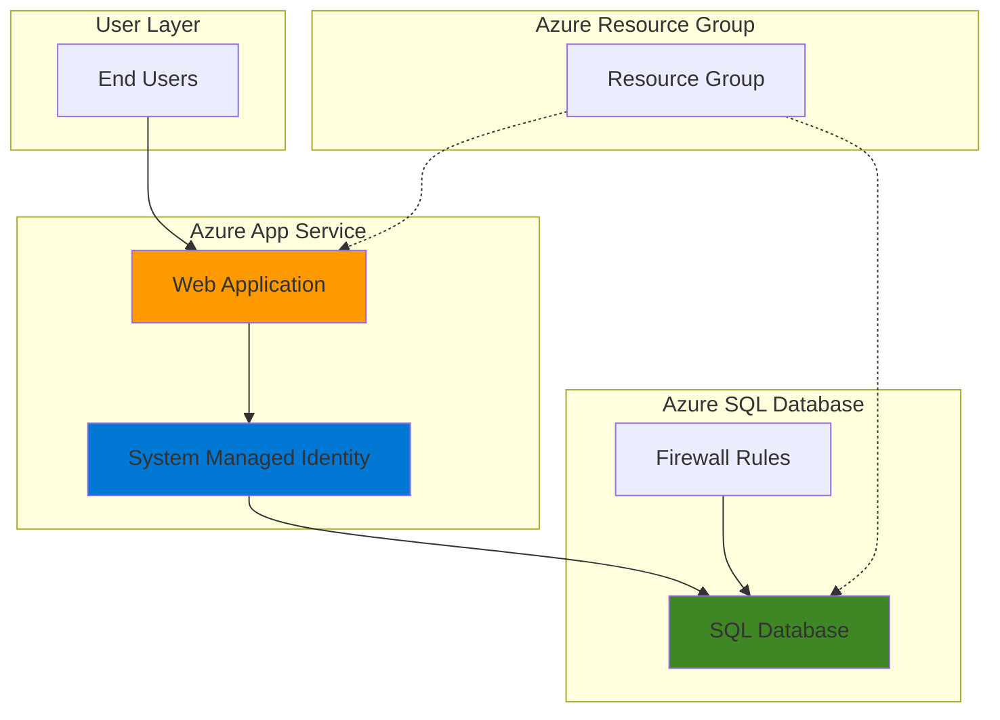

# Basic Database Web App with SQL Database and App Service

## Problem

Small businesses and development teams need to quickly deploy web applications with database connectivity but often struggle with complex infrastructure setup and security configurations. Without managed cloud services, teams spend significant time managing database servers, web hosting environments, and secure connections instead of focusing on application development and business logic.

## Solution

Azure App Service and Azure SQL Database provide a fully managed platform-as-a-service (PaaS) solution that eliminates infrastructure management while ensuring enterprise-grade security and scalability. This approach leverages Azure's built-in security features, automatic patching, and integrated monitoring to deliver a production-ready web application with secure database connectivity in minutes.

## Architecture Diagram



## Prerequisites

1. Azure account with appropriate permissions for creating App Service and SQL Database resources
2. Azure CLI installed and configured (version 2.37.0 or later)
3. Basic understanding of web applications and database concepts
4. Text editor for creating simple web application files
5. Estimated cost: $5-15/month for Basic tier resources (can be deleted after testing)

> **Note**: This recipe uses Azure's Basic pricing tiers to minimize costs while demonstrating core functionality. Production deployments should consider higher service tiers for performance and availability requirements.

## Preparation

```bash
# Set environment variables for Azure resources
export RESOURCE_GROUP="rg-webapp-demo-${RANDOM_SUFFIX}"
export LOCATION="eastus"
export SUBSCRIPTION_ID=$(az account show --query id --output tsv)

# Generate unique suffix for resource names
RANDOM_SUFFIX=$(openssl rand -hex 3)

# Set resource names with unique identifiers
export SQL_SERVER_NAME="sql-server-${RANDOM_SUFFIX}"
export SQL_DATABASE_NAME="TasksDB"
export APP_SERVICE_PLAN="asp-webapp-${RANDOM_SUFFIX}"
export WEB_APP_NAME="webapp-demo-${RANDOM_SUFFIX}"

# Create resource group
az group create \
    --name ${RESOURCE_GROUP} \
    --location ${LOCATION} \
    --tags purpose=recipe environment=demo

echo "✅ Resource group created: ${RESOURCE_GROUP}"
```

## Steps

1. **Create Azure SQL Database Server and Database**:

   Azure SQL Database provides enterprise-grade managed database services with built-in intelligence, security, and reliability. The logical server acts as a central administrative point for managing multiple databases, while individual databases can be scaled independently based on performance requirements.

   ```bash
   # Create SQL Database logical server
   az sql server create \
       --name ${SQL_SERVER_NAME} \
       --resource-group ${RESOURCE_GROUP} \
       --location ${LOCATION} \
       --admin-user sqladmin \
       --admin-password 'SecurePass123!' \
       --enable-ad-only-auth false
   
   # Create the database
   az sql db create \
       --resource-group ${RESOURCE_GROUP} \
       --server ${SQL_SERVER_NAME} \
       --name ${SQL_DATABASE_NAME} \
       --service-objective Basic \
       --backup-storage-redundancy Local
   
   echo "✅ SQL Database server and database created successfully"
   ```

   The Basic service tier provides 2GB of storage and is perfect for development and testing scenarios. The database is created with locally redundant backup storage to optimize costs while maintaining data protection through automatic backups and point-in-time restore capabilities.

2. **Configure Database Firewall for Azure Services**:

   Azure SQL Database includes a built-in firewall that blocks all external connections by default, providing security through network isolation. Enabling access for Azure services allows your App Service to communicate with the database while maintaining security by blocking external internet access.

   ```bash
   # Allow Azure services to access the database
   az sql server firewall-rule create \
       --resource-group ${RESOURCE_GROUP} \
       --server ${SQL_SERVER_NAME} \
       --name "AllowAzureServices" \
       --start-ip-address 0.0.0.0 \
       --end-ip-address 0.0.0.0
   
   echo "✅ Database firewall configured for Azure services"
   ```

   This firewall rule specifically allows access from Azure services while maintaining security boundaries. The 0.0.0.0 address range is a special Azure designation that enables trusted Azure services to connect while blocking public internet access.

3. **Create Database Schema and Sample Data**:

   Creating a database schema demonstrates the complete application lifecycle from infrastructure provisioning to data modeling. This step establishes the foundational data structure required for a typical task management application.

   ```bash
   # Create a simple table structure for demonstration
   az sql db query \
       --server ${SQL_SERVER_NAME} \
       --database ${SQL_DATABASE_NAME} \
       --auth-type SqlPassword \
       --username sqladmin \
       --password 'SecurePass123!' \
       --query "
       CREATE TABLE Tasks (
           Id INT IDENTITY(1,1) PRIMARY KEY,
           Title NVARCHAR(100) NOT NULL,
           Description NVARCHAR(500),
           IsCompleted BIT DEFAULT 0,
           CreatedDate DATETIME2 DEFAULT GETUTCDATE()
       );
       
       INSERT INTO Tasks (Title, Description) VALUES 
       ('Setup Database', 'Configure Azure SQL Database for the application'),
       ('Deploy Web App', 'Deploy the web application to Azure App Service'),
       ('Test Application', 'Verify database connectivity and functionality');"
   
   echo "✅ Database schema created with sample data"
   ```

   The schema includes modern SQL Server data types like NVARCHAR for Unicode support and DATETIME2 for precise timestamp handling. The IDENTITY column automatically generates primary keys, following database design best practices.

4. **Create App Service Plan**:

   An App Service Plan defines the compute resources, pricing tier, and features available to your web applications. The Basic tier provides dedicated compute instances with custom domains and SSL support, making it suitable for production workloads while remaining cost-effective.

   ```bash
   # Create App Service Plan
   az appservice plan create \
       --name ${APP_SERVICE_PLAN} \
       --resource-group ${RESOURCE_GROUP} \
       --location ${LOCATION} \
       --sku B1\
       --is-linux false
   
   echo "✅ App Service Plan created: ${APP_SERVICE_PLAN}"
   ```

   The B1 (Basic) tier provides 1.75GB RAM and 10GB storage, which is sufficient for development and small production applications with moderate traffic. The plan can be scaled up or down based on application demand.

5. **Create Web App with System-Assigned Managed Identity**:

   Azure App Service provides built-in hosting capabilities for web applications with integrated security, monitoring, and scaling features. The system-assigned managed identity eliminates the need to store database credentials in your application code, following Azure security best practices.

   ```bash
   # Create the web app with managed identity
   az webapp create \
       --name ${WEB_APP_NAME} \
       --resource-group ${RESOURCE_GROUP} \
       --plan ${APP_SERVICE_PLAN} \
       --runtime "DOTNETCORE:8.0" \
       --assign-identity
   
   # Get the managed identity principal ID
   MANAGED_IDENTITY_ID=$(az webapp identity show \
       --name ${WEB_APP_NAME} \
       --resource-group ${RESOURCE_GROUP} \
       --query principalId \
       --output tsv)
   
   echo "✅ Web App created with managed identity: ${MANAGED_IDENTITY_ID}"
   ```

   The managed identity provides a secure way for your application to authenticate with Azure services without storing credentials. This identity is automatically managed by Azure, including certificate rotation and lifecycle management.

6. **Configure Database Connection String**:

   Azure App Service provides secure configuration management through application settings and connection strings. These values are encrypted at rest and transmitted over secure channels, ensuring sensitive database information remains protected according to Azure security standards.

   ```bash
   # Set the database connection string
   az webapp config connection-string set \
       --name ${WEB_APP_NAME} \
       --resource-group ${RESOURCE_GROUP} \
       --connection-string-type SQLAzure \
       --settings DefaultConnection="Server=tcp:${SQL_SERVER_NAME}.database.windows.net,1433;Initial Catalog=${SQL_DATABASE_NAME};Persist Security Info=False;User ID=sqladmin;Password=SecurePass123!;MultipleActiveResultSets=False;Encrypt=True;TrustServerCertificate=False;Connection Timeout=30;"
   
   echo "✅ Database connection string configured"
   ```

   Connection strings in App Service are available as environment variables prefixed with `SQLAZURECONNSTR_`, allowing your application to discover them automatically at runtime without hardcoding sensitive information.

7. **Deploy Sample Web Application**:

   This step demonstrates the complete deployment process by creating and deploying a simple web application that confirms successful infrastructure setup and provides a foundation for further development.

   ```bash
   # Create a simple HTML page for testing
   cat > index.html << 'EOF'
<!DOCTYPE html>
<html>
<head>
    <title>Task Manager - Azure Demo</title>
    <style>
        body { font-family: -apple-system, BlinkMacSystemFont, 'Segoe UI', Roboto, sans-serif; margin: 40px; background-color: #f5f5f5; }
        .container { max-width: 800px; margin: 0 auto; background: white; padding: 30px; border-radius: 8px; box-shadow: 0 2px 10px rgba(0,0,0,0.1); }
        h1 { color: #0078d4; text-align: center; margin-bottom: 30px; }
        .status { padding: 15px; margin: 15px 0; border-radius: 6px; text-align: center; }
        .success { background-color: #d4edda; color: #155724; border: 1px solid #c3e6cb; }
        .info { background-color: #d1ecf1; color: #0c5460; border: 1px solid #bee5eb; }
        ul { line-height: 1.6; }
        .footer { margin-top: 30px; text-align: center; color: #666; font-size: 0.9em; }
    </style>
</head>
<body>
    <div class="container">
        <h1>🚀 Azure Web App Successfully Deployed!</h1>
        <div class="status success">
            <strong>✅ Deployment Status:</strong> Your web application is running on Azure App Service
        </div>
        <div class="status info">
            <strong>🔗 Database Connection:</strong> Ready to connect to Azure SQL Database
        </div>
        <div class="status info">
            <strong>🏗️ Architecture:</strong> This app demonstrates basic Azure App Service + SQL Database integration
        </div>
        <h2>Next Steps:</h2>
        <ul>
            <li>Add your application code to connect to the database using the configured connection string</li>
            <li>Configure managed identity for passwordless authentication to eliminate hardcoded credentials</li>
            <li>Enable Application Insights for monitoring and logging in Azure Monitor</li>
            <li>Set up CI/CD pipelines for automated deployments using Azure DevOps or GitHub Actions</li>
            <li>Configure custom domains and SSL certificates for production readiness</li>
        </ul>
        <div class="footer">
            <p>Built with Azure App Service and Azure SQL Database</p>
        </div>
    </div>
</body>
</html>
EOF
   
   # Deploy the HTML file
   az webapp deploy \
       --name ${WEB_APP_NAME} \
       --resource-group ${RESOURCE_GROUP} \
       --src-path index.html \
       --type static
   
   # Get the web app URL
   WEB_APP_URL=$(az webapp show \
       --name ${WEB_APP_NAME} \
       --resource-group ${RESOURCE_GROUP} \
       --query defaultHostName \
       --output tsv)
   
   echo "✅ Sample application deployed to: https://${WEB_APP_URL}"
   ```

   This creates a comprehensive demonstration page that confirms successful deployment and provides guidance for next steps. In production scenarios, you would replace this with your actual application code that connects to the database using the configured connection string.

## Validation & Testing

1. Verify web application accessibility:

   ```bash
   # Test web app endpoint
   curl -I https://${WEB_APP_URL}
   ```

   Expected output: HTTP 200 OK response indicating successful deployment and that the App Service is properly serving content.

2. Verify database connectivity:

   ```bash
   # Test database connection and query sample data
   az sql query \
       --server ${SQL_SERVER_NAME} \
       --database ${SQL_DATABASE_NAME} \
       --auth-type SqlPassword \
       --username sqladmin \
       --password 'SecurePass123!' \
       --query "SELECT COUNT(*) as TaskCount FROM Tasks;"
   ```

   Expected output: Shows count of 3 tasks confirming database setup and successful data insertion.

3. Verify Azure service integration:

   ```bash
   # Check App Service configuration
   az webapp config show \
       --name ${WEB_APP_NAME} \
       --resource-group ${RESOURCE_GROUP} \
       --query "connectionStrings"
   
   # Verify managed identity is enabled
   az webapp identity show \
       --name ${WEB_APP_NAME} \
       --resource-group ${RESOURCE_GROUP}
   ```

   Expected output: Connection strings configuration should show the SQLAzure connection, and managed identity should display the principalId and tenantId.

4. Test application in browser:

   ```bash
   echo "🌐 Visit your web application at: https://${WEB_APP_URL}"
   echo "📊 Azure Portal: https://portal.azure.com/#@/resource/subscriptions/${SUBSCRIPTION_ID}/resourceGroups/${RESOURCE_GROUP}/overview"
   ```

## Cleanup

1. Remove the resource group and all contained resources:

   ```bash
   # Delete resource group and all resources
   az group delete \
       --name ${RESOURCE_GROUP} \
       --yes \
       --no-wait
   
   echo "✅ Resource group deletion initiated: ${RESOURCE_GROUP}"
   echo "Note: Deletion may take several minutes to complete"
   ```

2. Verify resource cleanup:

   ```bash
   # Verify resource group deletion
   az group exists --name ${RESOURCE_GROUP}
   ```

   Expected output: "false" indicating the resource group has been successfully deleted.

3. Clean up local files:

   ```bash
   # Remove temporary files
   rm -f index.html
   unset RESOURCE_GROUP LOCATION SQL_SERVER_NAME SQL_DATABASE_NAME
   unset APP_SERVICE_PLAN WEB_APP_NAME RANDOM_SUFFIX MANAGED_IDENTITY_ID
   
   echo "✅ Local cleanup completed"
   ```

## Discussion

This recipe demonstrates the fundamental pattern for deploying database-driven web applications on Azure using managed Platform-as-a-Service offerings. Azure App Service provides a fully managed hosting environment that automatically handles infrastructure provisioning, security patching, and scaling, allowing developers to focus on application logic rather than infrastructure management. The service integrates seamlessly with other Azure services and provides built-in features like SSL termination, custom domains, and deployment slots for staging environments.

Azure SQL Database offers enterprise-grade database capabilities with built-in intelligence, security, and high availability. The service automatically handles database maintenance, backups, and security updates while providing features like automatic tuning, threat detection, and point-in-time restore. The combination of these services creates a robust foundation for modern web applications with minimal operational overhead and follows the Azure Well-Architected Framework principles.

The architecture follows Azure security best practices by implementing managed identities for secure authentication, network isolation through firewall rules, and encrypted connections for data in transit. For production deployments, consider implementing additional security measures such as Azure Key Vault for secrets management, Azure Application Insights for comprehensive monitoring, and Azure Front Door or Azure CDN for global content delivery and DDoS protection. The managed identity integration provides a pathway to eliminate password-based authentication entirely, following security guidance outlined in Microsoft's [Azure SQL Database security best practices](https://learn.microsoft.com/en-us/azure/azure-sql/database/security-best-practice).

> **Tip**: Enable Azure Application Insights to gain deep visibility into application performance, user behavior, and automatic failure detection. This provides actionable insights for optimizing both application performance and user experience while supporting modern DevOps practices.

## Challenge

Extend this solution by implementing these enhancements:

1. **Implement Managed Identity Authentication**: Replace SQL authentication with Azure AD authentication using the web app's managed identity, eliminating password-based database connections as recommended in [Azure SQL Database security best practices](https://learn.microsoft.com/en-us/azure/azure-sql/database/security-best-practice).

2. **Add Application Insights Monitoring**: Integrate Azure Application Insights to monitor application performance, track user interactions, and enable proactive issue detection with custom dashboards and intelligent alerting capabilities.

3. **Configure Deployment Slots**: Set up staging deployment slots to enable blue-green deployments, allowing you to test changes in production-like environments before swapping to the live site with zero-downtime deployments.

4. **Implement Auto-scaling**: Configure App Service auto-scaling rules based on CPU usage and request count to handle traffic spikes automatically while optimizing costs during low-traffic periods using built-in scaling policies.

5. **Add Azure Key Vault Integration**: Store sensitive configuration values in Azure Key Vault and reference them using Key Vault references in App Service configuration for enhanced security and centralized secrets management.

## Infrastructure Code

### Available Infrastructure as Code:

- [Infrastructure Code Overview](code/README.md) - Detailed description of all infrastructure components
- [Bicep](code/bicep/) - Azure Bicep templates
- [Bash CLI Scripts](code/scripts/) - Example bash scripts using Azure CLI commands to deploy infrastructure
- [Terraform](code/terraform/) - Terraform configuration files