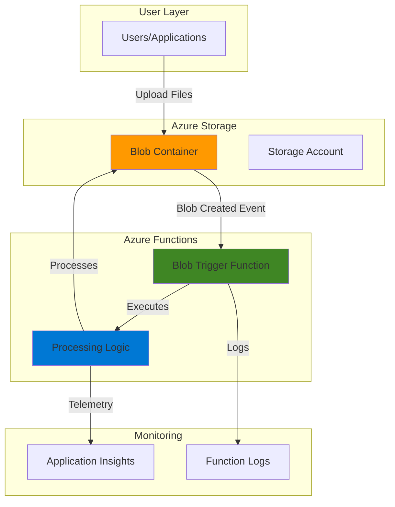

# File Upload Processing with Functions and Blob Storage

## Problem

Many modern applications require automatic processing of files uploaded by users, such as resizing images, extracting metadata, or validating file content. Traditional approaches using web servers require maintaining persistent infrastructure that scales poorly with unpredictable upload patterns and incurs costs during idle periods. Organizations need a serverless solution that automatically processes files upon upload without managing servers or paying for unused capacity.

## Solution

Azure Functions combined with Azure Blob Storage provides a serverless, event-driven file processing system that automatically triggers processing workflows when files are uploaded. This solution leverages Azure's consumption-based pricing model to execute code only when files are uploaded, eliminating infrastructure management overhead while providing automatic scaling and cost optimization for variable workloads.

## Architecture Diagram



## Prerequisites

1. Azure account with active subscription and permissions to create resource groups, storage accounts, and function apps
2. Azure CLI installed and configured (version 2.4 or later)
3. Basic understanding of serverless computing concepts and Azure Storage
4. Text editor for creating test files during validation
5. Estimated cost: $0.10-$2.00 USD for resources created during this exercise

> **Note**: The Consumption plan includes a monthly free grant of 1 million executions and 400,000 GB-seconds, making this recipe extremely cost-effective for learning and testing scenarios.


### Set environment variables for Azure resources
```bash
# Generate unique suffix for resource names
RANDOM_SUFFIX=$(openssl rand -hex 3)

# Set environment variables
export RESOURCE_GROUP="rg-file-processing-${RANDOM_SUFFIX}"
export LOCATION="eastus"
export SUBSCRIPTION_ID=$(az account show --query id --output tsv)


# Set resource names with unique suffix
export STORAGE_ACCOUNT="stfileproc${RANDOM_SUFFIX}"
export FUNCTION_APP="func-file-processing-${RANDOM_SUFFIX}"
export CONTAINER_NAME="uploads"

# Create resource group
az group create \
    --name ${RESOURCE_GROUP} \
    --location ${LOCATION} \
    --tags purpose=recipe environment=demo

echo "✅ Resource group created: ${RESOURCE_GROUP}"
```

## Steps

1. **Create Azure Storage Account with Blob Container**:

   Azure Storage provides massively scalable object storage with built-in redundancy and event integration capabilities. Creating a storage account establishes the foundation for file uploads and enables event-driven triggers that automatically execute Azure Functions when files are uploaded to specific containers.

   ```bash
   # Create storage account with hot access tier for active file processing
   az storage account create \
       --name ${STORAGE_ACCOUNT} \
       --resource-group ${RESOURCE_GROUP} \
       --location ${LOCATION} \
       --sku Standard_LRS \
       --kind StorageV2 \
       --access-tier Hot \
       --tags purpose=file-processing environment=demo
   
   echo "✅ Storage account created: ${STORAGE_ACCOUNT}"
   
   # Retrieve storage account connection string for function app configuration
   STORAGE_CONNECTION=$(az storage account show-connection-string \
       --name ${STORAGE_ACCOUNT} \
       --resource-group ${RESOURCE_GROUP} \
       --query connectionString \
       --output tsv)
   
   echo "Storage connection string retrieved successfully"
   ```

2. **Create Blob Container for File Uploads**:

   Blob containers organize uploaded files and serve as the event source for Azure Functions triggers. The container provides the isolated namespace where uploaded files will trigger processing workflows automatically.

   ```bash
   # Create container for file uploads with private access level
   az storage container create \
       --name ${CONTAINER_NAME} \
       --connection-string "${STORAGE_CONNECTION}" \
       --public-access off
   
   echo "✅ Blob container created: ${CONTAINER_NAME}"
   
   # Verify container creation
   az storage container show \
       --name ${CONTAINER_NAME} \
       --connection-string "${STORAGE_CONNECTION}" \
       --query name \
       --output tsv
   ```

3. **Create Azure Function App with Consumption Plan**:

   Azure Functions provides serverless compute that automatically scales based on demand and implements consumption-based billing. The Consumption plan is ideal for file processing scenarios with unpredictable upload patterns, as it scales to zero when idle and charges only for actual execution time.

   ```bash
   # Create Function App with Consumption plan for cost-effective scaling
   az functionapp create \
       --name ${FUNCTION_APP} \
       --resource-group ${RESOURCE_GROUP} \
       --storage-account ${STORAGE_ACCOUNT} \
       --consumption-plan-location ${LOCATION} \
       --runtime node \
       --runtime-version 24 \
       --functions-version 4 \
       --tags purpose=file-processing environment=demo
   
   echo "✅ Function App created: ${FUNCTION_APP}"
   
   # Wait for function app to be fully provisioned
   sleep 30
   ```

4. **Configure Function App with Storage Connection**:

   Function apps require explicit connection string configuration to access storage accounts for both function storage needs and blob trigger functionality. This configuration enables the runtime to monitor blob containers for new file uploads and execute functions accordingly.

   ```bash
   # Configure storage connection for blob trigger access
   az functionapp config appsettings set \
       --name ${FUNCTION_APP} \
       --resource-group ${RESOURCE_GROUP} \
       --settings "STORAGE_CONNECTION_STRING=${STORAGE_CONNECTION}"
   
   echo "✅ Function App configured with storage connection"
   
   # Verify configuration
   az functionapp config appsettings list \
       --name ${FUNCTION_APP} \
       --resource-group ${RESOURCE_GROUP} \
       --query "[?name=='STORAGE_CONNECTION_STRING'].value" \
       --output tsv | head -20
   ```

5. **Create Blob Trigger Function**:

   Blob trigger functions automatically execute when files are uploaded to monitored containers. This serverless approach eliminates polling overhead and provides near real-time file processing capabilities with automatic scaling based on upload volume.

   ```bash
   # Create directory for function code
   mkdir -p function-code
   cd function-code
   ```

6. **Create function.json configuration for blob trigger**
    ```bash
   cat > function.json << 'EOF'
{
"bindings": [
    {
    "name": "myBlob",
    "type": "blobTrigger",
    "direction": "in",
    "path": "uploads/{name}",
    "connection": "STORAGE_CONNECTION_STRING"
    }
]
}
EOF
    ```

7. **Create JavaScript function code for file processing**
    ```bash
   cat > index.js << 'EOF'
module.exports = async function (context, myBlob) {
    const fileName = context.bindingData.name;
    const fileSize = myBlob.length;
    const timestamp = new Date().toISOString();
    
    context.log(`🔥 Processing file: ${fileName}`);
    context.log(`📊 File size: ${fileSize} bytes`);
    context.log(`⏰ Processing time: ${timestamp}`);
    
    // Simulate file processing logic
    if (fileName.toLowerCase().includes('.jpg') || fileName.toLowerCase().includes('.png')) {
        context.log(`🖼️  Image file detected: ${fileName}`);
        context.log(`✅ Image processing completed successfully`);
    } else if (fileName.toLowerCase().includes('.pdf')) {
        context.log(`📄 PDF document detected: ${fileName}`);
        context.log(`✅ PDF processing completed successfully`);
    } else {
        context.log(`📁 Generic file detected: ${fileName}`);
        context.log(`✅ File processing completed successfully`);
    }
    
    context.log(`🎉 File processing workflow completed for: ${fileName}`);
};
EOF
   ```
   echo "✅ Function code created successfully"
   cd ..
   

8. **Deploy Function to Azure**:

   Function deployment transfers the trigger configuration and processing logic to Azure's serverless infrastructure. Once deployed, the function automatically monitors the specified blob container and executes the processing workflow whenever new files are uploaded.

   ```bash
   # Create ZIP package for deployment
   cd function-code
   zip -r ../function-deploy.zip .
   cd ..
   
   # Deploy function code to Azure
   az functionapp deployment source config-zip \
       --name ${FUNCTION_APP} \
       --resource-group ${RESOURCE_GROUP} \
       --src function-deploy.zip
   
   echo "✅ Function deployed successfully"
   
   # Wait for deployment to complete
   sleep 15
   
   # Verify function deployment
   az functionapp function list \
       --name ${FUNCTION_APP} \
       --resource-group ${RESOURCE_GROUP} \
       --query "[].name" \
       --output tsv
   ```

## Validation & Testing

1. **Verify Function App and Storage Integration**:

   ```bash
   # Check function app status
   az functionapp show \
       --name ${FUNCTION_APP} \
       --resource-group ${RESOURCE_GROUP} \
       --query "state" \
       --output tsv
   
   # Verify storage account accessibility
   az storage account show \
       --name ${STORAGE_ACCOUNT} \
       --resource-group ${RESOURCE_GROUP} \
       --query "provisioningState" \
       --output tsv
   ```

   Expected output: Both commands should return `Running` and `Succeeded` respectively.

2. **Test File Upload and Processing Trigger**:

   ```bash
   # Create test file for upload
   echo "This is a test file for Azure Functions processing" > test-file.txt
   echo "Test image content simulation" > test-image.jpg
   
   # Upload test files to trigger function execution
   az storage blob upload \
       --file test-file.txt \
       --name "test-document-$(date +%s).txt" \
       --container-name ${CONTAINER_NAME} \
       --connection-string "${STORAGE_CONNECTION}"
   
   az storage blob upload \
       --file test-image.jpg \
       --name "test-image-$(date +%s).jpg" \
       --container-name ${CONTAINER_NAME} \
       --connection-string "${STORAGE_CONNECTION}"
   
   echo "✅ Test files uploaded successfully"
   ```

3. **Monitor Function Execution Logs**:

   ```bash
   # View function execution logs using streaming
   echo "Starting log streaming... (Press Ctrl+C to stop)"
   az webapp log tail \
       --name ${FUNCTION_APP} \
       --resource-group ${RESOURCE_GROUP} \
       --provider application &
   
   # Let logs stream for a moment
   sleep 10
   
   # Stop log streaming
   kill %1 2>/dev/null || true
   echo "✅ Log streaming stopped"
   ```

   Expected output: You should see function execution logs with file processing messages indicating successful blob trigger activation.

## Cleanup

1. **Remove all Azure resources**:

   ```bash
   # Delete resource group and all contained resources
   az group delete \
       --name ${RESOURCE_GROUP} \
       --yes \
       --no-wait
   
   echo "✅ Resource group deletion initiated: ${RESOURCE_GROUP}"
   echo "Note: Deletion may take several minutes to complete"
   ```

2. **Clean up local files**:

   ```bash
   # Remove local function code and test files
   rm -rf function-code
   rm -f function-deploy.zip test-file.txt test-image.jpg
   
   # Clear environment variables
   unset RESOURCE_GROUP LOCATION STORAGE_ACCOUNT FUNCTION_APP CONTAINER_NAME STORAGE_CONNECTION RANDOM_SUFFIX
   
   echo "✅ Local cleanup completed"
   ```

## Discussion

This serverless file processing solution demonstrates the power of event-driven architecture using Azure Functions and Blob Storage. The blob trigger pattern eliminates the need for continuous polling or scheduled jobs, providing near real-time file processing with automatic scaling based on upload volume. This approach is particularly effective for scenarios with unpredictable file upload patterns, as the Consumption plan scales to zero during idle periods and charges only for actual execution time.

The solution follows [Azure Well-Architected Framework](https://docs.microsoft.com/en-us/azure/architecture/framework/) principles by implementing cost optimization through consumption-based billing, operational excellence through automated scaling, and reliability through Azure's managed infrastructure. The blob trigger mechanism provides built-in retry logic and dead letter handling, ensuring robust file processing even during transient failures. Additionally, Azure Functions integrates seamlessly with Application Insights for comprehensive monitoring and troubleshooting capabilities.

From a cost perspective, the Consumption plan offers exceptional value for file processing workloads. With the monthly free grant of 1 million executions and 400,000 GB-seconds, many small to medium-scale file processing scenarios can operate within the free tier. Even beyond the free tier, the consumption-based model ensures you only pay for actual file processing time, making it significantly more cost-effective than maintaining dedicated servers for intermittent workloads.

The architecture can be extended to support advanced scenarios such as image resizing, document analysis using Azure Cognitive Services, or data pipeline orchestration. For high-volume scenarios requiring consistent latency, the Premium plan provides pre-warmed instances and virtual network integration capabilities. The solution also supports multiple programming languages including C#, Python, Java, and PowerShell, enabling teams to leverage existing skills and libraries. For more information on Azure Functions capabilities, see the [Azure Functions documentation](https://docs.microsoft.com/en-us/azure/azure-functions/).

> **Tip**: Monitor your function execution patterns using Azure Monitor and consider implementing always-ready instances in the Flex Consumption plan for workloads requiring consistent low-latency processing.

## Challenge

Extend this solution by implementing these enhancements:

1. **Add file type validation and routing** - Implement different processing workflows based on file extensions, routing images to Computer Vision services and documents to Form Recognizer for content extraction.

2. **Implement error handling and retry logic** - Add comprehensive error handling with custom retry policies and dead letter queues for failed processing attempts.

3. **Create output bindings for processed files** - Configure output bindings to automatically save processed files to different containers or send notifications via Service Bus or Event Grid.

4. **Add monitoring and alerting** - Implement Application Insights custom metrics and Azure Monitor alerts for processing failures, execution duration, and cost thresholds.

5. **Scale to multi-region deployment** - Deploy the solution across multiple Azure regions with geo-replicated storage for high availability and reduced latency for global users.

## Infrastructure Code

### Available Infrastructure as Code:

- [Infrastructure Code Overview](code/README.md) - Detailed description of all infrastructure components
- [Bicep](code/bicep/) - Azure Bicep templates
- [Bash CLI Scripts](code/scripts/) - Example bash scripts using Azure CLI commands to deploy infrastructure
- [Terraform](code/terraform/) - Terraform configuration files