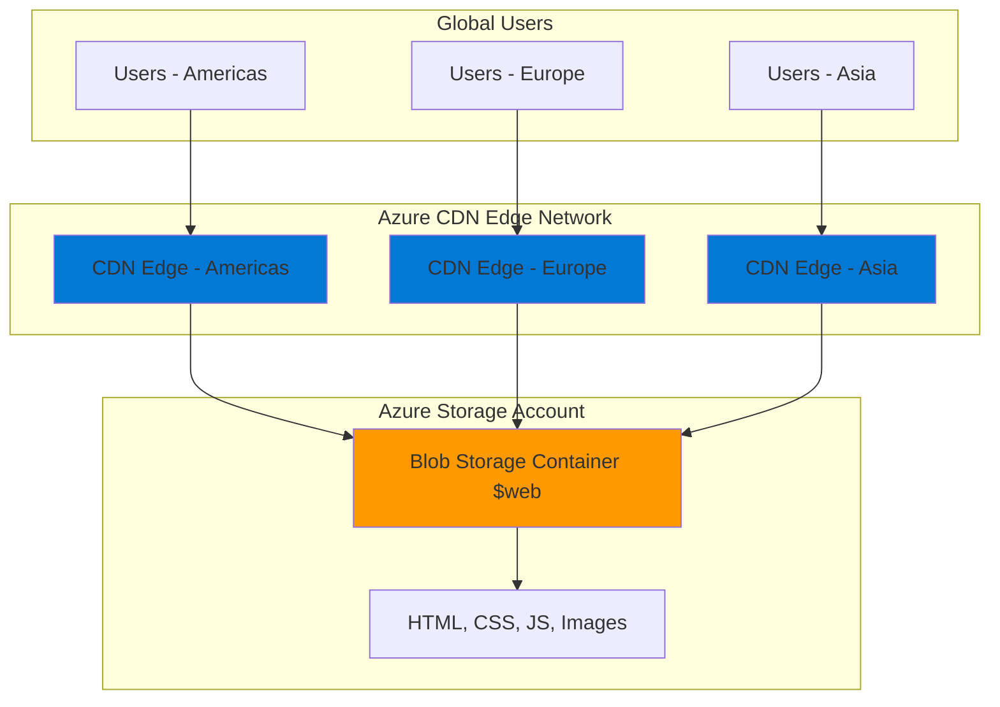

# Static Website Acceleration with CDN and Storage

## Problem

A growing e-commerce company needs to deliver their product catalog website to customers worldwide, but users in distant geographic regions experience slow page load times and poor user experience. The current web hosting solution lacks global reach, resulting in abandoned shopping sessions and reduced conversion rates due to performance issues that directly impact revenue.

## Solution

Deploy a globally distributed static website using Azure Storage Account's built-in static hosting capabilities combined with Azure CDN for worldwide content acceleration. This approach leverages Azure's global edge network to cache and deliver content from locations closest to users, dramatically reducing latency while providing cost-effective, serverless web hosting.

## Architecture Diagram



## Prerequisites

1. Azure account with active subscription and Storage Account Contributor permissions
2. Azure CLI installed and configured (version 2.30.0 or later)
3. Basic understanding of HTML/CSS for static website content
4. Understanding of DNS and domain management concepts
5. Estimated cost: $1-5 per month depending on storage and bandwidth usage

> **Note**: Static website hosting is free in Azure Storage - you only pay for storage space and data transfer costs.

## Preparation

```bash
# Set environment variables for Azure resources
export RESOURCE_GROUP="rg-static-website-${RANDOM_SUFFIX}"
export LOCATION="eastus"
export SUBSCRIPTION_ID=$(az account show --query id --output tsv)

# Generate unique suffix for resource names
RANDOM_SUFFIX=$(openssl rand -hex 3)

# Set storage account and CDN endpoint names
export STORAGE_ACCOUNT="staticsite${RANDOM_SUFFIX}"
export CDN_PROFILE="cdn-profile-${RANDOM_SUFFIX}"
export CDN_ENDPOINT="website-${RANDOM_SUFFIX}"

# Create resource group
az group create \
    --name ${RESOURCE_GROUP} \
    --location ${LOCATION} \
    --tags purpose=recipe environment=demo

echo "✅ Resource group created: ${RESOURCE_GROUP}"
```

## Steps

1. **Create Storage Account with Static Website Support**:

   Azure Storage Account provides the foundation for static website hosting with built-in web server capabilities. When configured for static websites, it automatically serves HTML, CSS, JavaScript, and image files from a special `$web` container, eliminating the need for traditional web servers while providing massive scalability and 99.9% availability SLA.

   ```bash
   # Create storage account optimized for web hosting
   az storage account create \
       --name ${STORAGE_ACCOUNT} \
       --resource-group ${RESOURCE_GROUP} \
       --location ${LOCATION} \
       --sku Standard_LRS \
       --kind StorageV2 \
       --access-tier Hot \
       --https-only true \
       --tags purpose=static-website

   echo "✅ Storage account created: ${STORAGE_ACCOUNT}"
   ```

   The storage account is now ready with modern StorageV2 capabilities and enforced HTTPS for security. The Hot access tier ensures optimal performance for frequently accessed website content.

2. **Enable Static Website Hosting**:

   Static website hosting transforms your storage account into a web server by creating a `$web` container and configuring web endpoints. This feature enables direct serving of static content with automatic index document routing and custom error page support, providing enterprise-grade hosting capabilities without infrastructure management overhead.

   ```bash
   # Enable static website hosting with index and error pages
   az storage blob service-properties update \
       --account-name ${STORAGE_ACCOUNT} \
       --static-website \
       --404-document 404.html \
       --index-document index.html

   # Get the static website URL
   WEBSITE_URL=$(az storage account show \
       --name ${STORAGE_ACCOUNT} \
       --resource-group ${RESOURCE_GROUP} \
       --query "primaryEndpoints.web" \
       --output tsv)

   echo "✅ Static website enabled"
   echo "Website URL: ${WEBSITE_URL}"
   ```

   Your storage account now functions as a web server with automatic routing to index.html and custom 404 error handling, providing a professional user experience.

3. **Create Sample Website Content**:

   A well-structured website requires optimized HTML, CSS, and assets that work effectively with CDN caching strategies. This sample content demonstrates best practices for static websites including proper meta tags, compression-friendly markup, and cache-optimized resource organization.

   ```bash
   # Create sample HTML content
   cat > index.html << 'EOF'
<!DOCTYPE html>
<html lang="en">
<head>
    <meta charset="UTF-8">
    <meta name="viewport" content="width=device-width, initial-scale=1.0">
    <title>Global Product Catalog - Accelerated by Azure CDN</title>
    <link rel="stylesheet" href="styles.css">
</head>
<body>
    <header>
        <h1>Welcome to Our Global Store</h1>
        <p>Lightning-fast delivery worldwide via Azure CDN</p>
    </header>
    <main>
        <section class="hero">
            <h2>Experience Global Performance</h2>
            <p>This website is delivered from Azure's global edge network, 
               ensuring fast loading times regardless of your location.</p>
        </section>
        <section class="products">
            <h3>Featured Products</h3>
            <div class="product-grid">
                <div class="product">Premium Headphones - $299</div>
                <div class="product">Smart Watch - $399</div>
                <div class="product">Wireless Speaker - $199</div>
            </div>
        </section>
    </main>
    <script src="app.js"></script>
</body>
</html>
EOF

   # Create CSS stylesheet
   cat > styles.css << 'EOF'
* { margin: 0; padding: 0; box-sizing: border-box; }
body { font-family: Arial, sans-serif; line-height: 1.6; color: #333; }
header { background: #0078D4; color: white; padding: 2rem; text-align: center; }
.hero { padding: 3rem 2rem; background: #f4f4f4; text-align: center; }
.products { padding: 2rem; }
.product-grid { display: grid; grid-template-columns: repeat(auto-fit, minmax(200px, 1fr)); gap: 1rem; margin-top: 1rem; }
.product { background: white; padding: 1rem; border-radius: 8px; box-shadow: 0 2px 5px rgba(0,0,0,0.1); }
EOF

   # Create JavaScript file
   cat > app.js << 'EOF'
document.addEventListener('DOMContentLoaded', function() {
    console.log('Static website loaded via Azure CDN');
    
    // Add performance timing
    window.addEventListener('load', function() {
        const loadTime = performance.timing.loadEventEnd - performance.timing.navigationStart;
        console.log('Page load time: ' + loadTime + 'ms');
    });
});
EOF

   # Create 404 error page
   cat > 404.html << 'EOF'
<!DOCTYPE html>
<html lang="en">
<head>
    <meta charset="UTF-8">
    <meta name="viewport" content="width=device-width, initial-scale=1.0">
    <title>Page Not Found - Global Store</title>
    <link rel="stylesheet" href="styles.css">
</head>
<body>
    <header><h1>Page Not Found</h1></header>
    <main style="padding: 2rem; text-align: center;">
        <h2>404 - Content Not Available</h2>
        <p>The requested page could not be found.</p>
        <a href="/" style="color: #0078D4;">Return to Home</a>
    </main>
</body>
</html>
EOF

   echo "✅ Website content created successfully"
   ```

   The website content is now ready with optimized structure, responsive design, and proper error handling for a professional user experience.

4. **Upload Website Content to Storage**:

   Uploading content to the `$web` container makes it immediately available via the static website endpoint. Azure Storage automatically handles content-type detection and HTTP headers, while the batch upload ensures atomic deployment of all website assets for consistent user experience.

   ```bash
   # Upload all website files to the $web container
   az storage blob upload-batch \
       --account-name ${STORAGE_ACCOUNT} \
       --source . \
       --destination '$web' \
       --pattern "*.html" \
       --content-type "text/html"

   az storage blob upload-batch \
       --account-name ${STORAGE_ACCOUNT} \
       --source . \
       --destination '$web' \
       --pattern "*.css" \
       --content-type "text/css"

   az storage blob upload-batch \
       --account-name ${STORAGE_ACCOUNT} \
       --source . \
       --destination '$web' \
       --pattern "*.js" \
       --content-type "application/javascript"

   echo "✅ Website content uploaded to storage"
   echo "Direct access URL: ${WEBSITE_URL}"
   ```

   Your website is now live and accessible directly from Azure Storage, ready for CDN acceleration and global distribution.

5. **Create CDN Profile and Endpoint**:

   Azure CDN provides global content delivery through strategically placed edge servers worldwide. Creating a CDN profile establishes the management boundary, while the endpoint creates the cached delivery mechanism that dramatically reduces latency for users regardless of their geographic location.

   ```bash
   # Create CDN profile using Microsoft's global network
   az cdn profile create \
       --name ${CDN_PROFILE} \
       --resource-group ${RESOURCE_GROUP} \
       --sku Standard_Microsoft \
       --tags purpose=content-delivery

   # Extract origin hostname from website URL for CDN configuration
   ORIGIN_HOSTNAME=$(echo ${WEBSITE_URL} | sed 's|https://||' | sed 's|/||')
    ```

    ```bash
   # Create CDN endpoint pointing to static website
   az cdn endpoint create \
       --name ${CDN_ENDPOINT} \
       --profile-name ${CDN_PROFILE} \
       --resource-group ${RESOURCE_GROUP} \
       --origin ${ORIGIN_HOSTNAME} \
       --origin-host-header ${ORIGIN_HOSTNAME} \
       --enable-compression true \
       --content-types-to-compress "text/html" "text/css" "application/javascript" \
       --tags purpose=global-acceleration

   # Get CDN endpoint URL
   CDN_URL=$(az cdn endpoint show \
       --name ${CDN_ENDPOINT} \
       --profile-name ${CDN_PROFILE} \
       --resource-group ${RESOURCE_GROUP} \
       --query "hostName" \
       --output tsv)

   echo "✅ CDN endpoint created successfully"
   echo "CDN URL: https://${CDN_URL}"
   ```

   Your website is now globally distributed through Azure's CDN network with automatic compression enabled for optimal performance and reduced bandwidth usage.

6. **Configure CDN Caching Optimization**:

   Modern Azure CDN provides built-in intelligent caching for static websites with optimized defaults. The Standard Microsoft tier automatically applies appropriate cache durations based on content type and includes query string optimization for better cache hit ratios.

   ```bash
   # Configure query string caching behavior for better performance
   az cdn endpoint update \
       --name ${CDN_ENDPOINT} \
       --profile-name ${CDN_PROFILE} \
       --resource-group ${RESOURCE_GROUP} \
       --query-string-caching-behavior "IgnoreQueryString"

   # Enable optimization for general web delivery
   az cdn endpoint update \
       --name ${CDN_ENDPOINT} \
       --profile-name ${CDN_PROFILE} \
       --resource-group ${RESOURCE_GROUP} \
       --optimization-type "GeneralWebDelivery"

   echo "✅ CDN caching optimization configured"
   echo "Query strings ignored for better cache efficiency"
   ```

   The CDN now uses optimized caching strategies with intelligent defaults that automatically balance performance with content freshness for your global audience.

## Validation & Testing

1. **Verify Storage Account Static Website**:

   ```bash
   # Test direct storage website access
   curl -I ${WEBSITE_URL}
   
   # Verify website content loads properly
   curl -s ${WEBSITE_URL} | head -10
   ```

   Expected output: HTTP 200 response with HTML content serving correctly from the static website endpoint.

2. **Test CDN Endpoint Functionality**:

   ```bash
   # Test CDN endpoint accessibility (may take 5-10 minutes to propagate)
   curl -I https://${CDN_URL}
   
   # Check CDN headers for cache information
   curl -H "Accept-Encoding: gzip" -I https://${CDN_URL}
   ```

   Expected output: HTTP 200 response with CDN headers including cache status and compression information.

3. **Validate Global Performance**:

   ```bash
   # Test performance from CDN vs direct storage
   echo "Testing direct storage access speed..."
   time curl -s ${WEBSITE_URL} > /dev/null
   
   echo "Testing CDN access speed..."
   time curl -s https://${CDN_URL} > /dev/null
   ```

   Expected result: CDN should show improved response times, especially on subsequent requests due to edge caching.

## Cleanup

1. **Remove CDN Resources**:

   ```bash
   # Delete CDN endpoint
   az cdn endpoint delete \
       --name ${CDN_ENDPOINT} \
       --profile-name ${CDN_PROFILE} \
       --resource-group ${RESOURCE_GROUP} \
       --yes

   # Delete CDN profile
   az cdn profile delete \
       --name ${CDN_PROFILE} \
       --resource-group ${RESOURCE_GROUP} \
       --yes

   echo "✅ CDN resources deleted"
   ```

2. **Remove Storage Account and Resource Group**:

   ```bash
   # Delete entire resource group and all contained resources
   az group delete \
       --name ${RESOURCE_GROUP} \
       --yes \
       --no-wait

   echo "✅ Resource group deletion initiated: ${RESOURCE_GROUP}"
   echo "Note: Deletion may take several minutes to complete"

   # Clean up local files
   rm -f index.html styles.css app.js 404.html

   echo "✅ Local files cleaned up"
   ```

3. **Verify Resource Cleanup**:

   ```bash
   # Verify resource group deletion
   az group exists --name ${RESOURCE_GROUP}
   ```

   Expected output: `false` when deletion completes successfully.

## Discussion

This recipe demonstrates the power of combining Azure Storage static website hosting with Azure CDN to create a globally distributed, high-performance web solution. Azure Storage's static website feature provides serverless hosting capabilities with automatic scaling, 99.9% availability SLA, and built-in security features. The `$web` container automatically serves static content with proper HTTP headers and supports index document routing, making it ideal for modern single-page applications and static websites.

Azure CDN enhances this foundation by caching content at over 100 global edge locations, dramatically reducing latency for users worldwide. The Standard Microsoft tier provides excellent performance with built-in DDoS protection and automatic failover capabilities. The intelligent caching system automatically optimizes cache durations based on content type, ensuring static assets like CSS and JavaScript files are cached efficiently while maintaining content freshness.

The compression feature automatically reduces bandwidth usage by up to 80% for text-based content, further improving load times and reducing costs. This architecture follows Azure Well-Architected Framework principles by prioritizing performance efficiency and cost optimization while maintaining high reliability and security standards. The query string optimization ensures better cache hit ratios and improved performance for dynamic content scenarios.

This solution is particularly effective for e-commerce product catalogs, marketing websites, documentation sites, and any content-heavy applications requiring global reach. The serverless nature eliminates infrastructure management overhead while providing enterprise-grade performance and scalability.

> **Tip**: Enable Azure Monitor and Application Insights to track CDN performance metrics, cache hit ratios, and user experience data for continuous optimization.

For comprehensive guidance, see the official Microsoft documentation on [Static website hosting in Azure Storage](https://learn.microsoft.com/en-us/azure/storage/blobs/storage-blob-static-website), [Azure CDN overview](https://learn.microsoft.com/en-us/azure/cdn/cdn-overview), [CDN caching behavior](https://learn.microsoft.com/en-us/azure/cdn/cdn-caching-rules), [Azure Storage performance checklist](https://learn.microsoft.com/en-us/azure/storage/blobs/storage-performance-checklist), and [Azure CDN best practices](https://learn.microsoft.com/en-us/azure/cdn/cdn-optimization-overview).

## Challenge

Extend this solution by implementing these enhancements:

1. **Custom Domain and SSL**: Configure a custom domain name with automated SSL certificate management using Azure CDN's domain validation features and Let's Encrypt integration.

2. **Advanced Caching Strategies**: Implement custom caching rules using Azure Front Door for more granular control over cache behavior, geo-filtering for content regionalization, and automated cache purging for content updates.

3. **Security Enhancements**: Add Web Application Firewall (WAF) rules, implement rate limiting, and configure Azure Front Door for additional DDoS protection and traffic acceleration.

4. **Monitoring and Analytics**: Deploy Azure Application Insights for real user monitoring, configure custom dashboards for CDN performance metrics, and set up automated alerts for availability and performance thresholds.

5. **CI/CD Integration**: Create GitHub Actions or Azure DevOps pipelines for automated content deployment with cache invalidation and blue-green deployment strategies.

## Infrastructure Code

### Available Infrastructure as Code:

- [Infrastructure Code Overview](code/README.md) - Detailed description of all infrastructure components
- [Bicep](code/bicep/) - Azure Bicep templates
- [Bash CLI Scripts](code/scripts/) - Example bash scripts using Azure CLI commands to deploy infrastructure
- [Terraform](code/terraform/) - Terraform configuration files